# 《深度学习入门：基于Python的理论与实现》

[TOC]

**Link**：http://www.ituring.com.cn/book/1921


**表述规则**

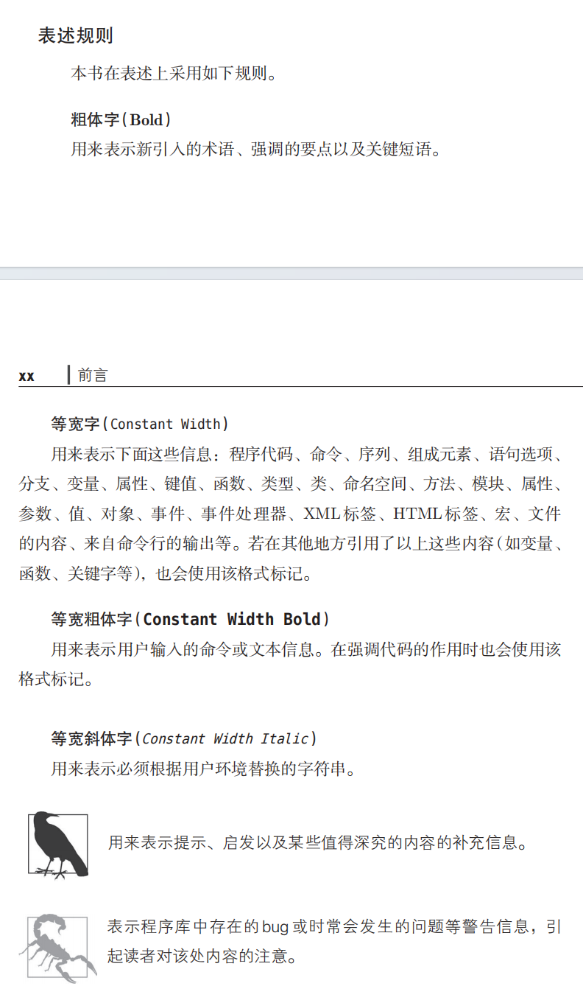

## 第1章 Python入门

### 1.1 Python是什么

reading...

### 1.2 Python的安装

考虑create一个通用的学习环境

综合对比study、research、learn、test、main、play等名称，最终选用**lab**。


目前最新Python版本为3.13，考虑到兼容性，选择3.12版本

`conda create --name lab python=3.12`

遇到网络问题，设置USTC镜像源重新安装

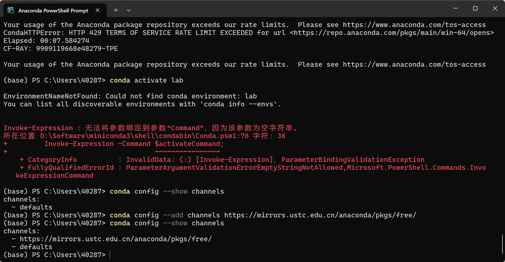

### 1.3 Python解释器

coding...

关闭Python解释器：Windows：Ctrl-Z  + Enter

### 1.4 Python脚本文件

考虑目录结构：

- 章节优先：/ch1/code

- **类型优先**：/code/ch1

### 1.5 Numpy

coding...

广播是通过扩展实现形状实现的

理解以下代码

```python
A = np.array([1, 2], [3, 4])
B = np.array([10, 20])
A * B
```

```python
X[X > 15]
```

### 1.6 Matplotlib

coding...

## 第2章 感知机

### 2.1 感知机是什么

reading...

### 2.2 简单逻辑电路

reading...

### 2.3 感知机的实现

coding...

`x = np.array(x1, x2)`❌

`x = np.array((x1, x2))`✔

`x = np.array([x1, x2])`✔

### 2.4 感知机的局限性

上述感知机可理解为用一条直线分割二维平面，因此无法实现异或门

### 2.5 多层感知机

单层感知机无法分离线性空间

```python
def XOR(x1, x2):
    s1 = NAND(x1, x2)
    s2 = OR(x1, x2)
    y = AND(s1, s2)
    return y
```

### 2.6 从与非门到计算机

reading...

## 第3章 神经网络

### 3.1 从感知机到神经网络

reading...

### 3.2 激活函数

书中 `np.int` 已被弃用

`np.int_` 为更推荐的用法

```python
def step_function(x):
    y = x > 0
    return y.astype(np.int_)
```


书中 `import matplotlib.pylab as plt`

推荐 `import matplotlib.pyplot as plt`


python中直接写`plt.show`（没加()）也不会报错，表示函数引用，只有加()才表示函数调用


为什么python中运算符可以直接参与np.array运算，但是自定义函数不行？

- **运算符**能工作是因为NumPy重载了它们
- **自定义函数**需要显式使用NumPy函数或`np.vectorize`来获得相同的行为
- 或确保函数支持数组运算
- 最佳实践是在自定义函数中**使用NumPy函数**而不是Python内置操作符


- `np.max(0, x)`：错误用法，`np.max()` 用于找数组中的最大值
- `np.maximum(0, x)`：正确用法，逐元素比较两个输入，返回每个位置的最大值

### 3.3 多维数组的运算

~~在NumPy中，一维数组和二维数组的乘法行为确实存在差异？~~

- ~~实际上，`*` 运算符在NumPy中对于任何维度的数组都是执行逐元素乘法~~
- ~~看似不一致的行为，是由于NumPy的广播机制~~


为什么这个可以正常算？X是(2,)，W是(2, 3)

```python
import numpy as np

X = np.array([1, 2])
print(X.shape)

W = np.array([[1, 3, 5], [2, 4, 6]])
print(W.shape)

Y = np.dot(X, W)
print(Y.shape)
```

`np.dot(a, b)` 的维度匹配规则是：

- **最后一个维度**的 `a` 必须与 **第一个维度** 的 `b` 相匹配

```python
# 情况1：两个一维数组 → 点积（标量）
a = np.array([1, 2])
b = np.array([3, 4])
np.dot(a, b)  # 1×3 + 2×4 = 11

# 情况2：一维与二维 → 矩阵-向量乘法
a = np.array([1, 2])        # (2,)
b = np.array([[1, 3, 5],    # (2, 3)
              [2, 4, 6]])
np.dot(a, b)  # (3,)

# 情况3：两个二维数组 → 矩阵乘法
a = np.array([[1, 2]])      # (1, 2)
b = np.array([[1, 3, 5],    # (2, 3)
              [2, 4, 6]])
np.dot(a, b)  # (1, 3)
```

### 3.4 3层神经网路的实现

coding...

### 3.5 输出层的设计

注意：

该函数在a存在较大元素时会出错nan

```python
def softmax(a):
    y = np.exp(a) / np.sum(np.exp(a))
    return y
```

改为

```python
def softmax(a):
    c = np.max(a)
    return np.exp(a - c) / np.sum(np.exp(a - c))
```

### 3.6手写数字识别

PIL = Python Imaging Library（Python 图像处理库）

PIL Image 的 mode，MNIST 是'L'（灰度）

> 
>
> ### ✅ 总结
>
> - `from PIL import Image` 是 Python 处理图像的**标准方式**（实际用的是 Pillow 库）
> - **`torchvision` 内部用 PIL 加载图像**，再根据你的 `transform` 决定是否转成 Tensor
> - 你现在用 `transforms.ToTensor()`，所以**看不到 PIL Image**，但它在底层默默工作
> - 如果你以后要处理自己的图片数据集，就会经常用到 `Image.open()`
>
> 💡 **小知识**：
> 你之前遇到的 `RuntimeError: Numpy is not available`，其实是因为 `torchvision` 在把 PIL Image 转 Tensor 时，中间会经过 NumPy，所以 NumPy 必须存在！


```python
def init_network():
    network = {}

    # 第1层
    network['W1'] = np.random.randn(784, 50) * 0.01
    network['b1'] = np.zeros(50)

    # 第2层
    network['W2'] = np.random.randn(50, 100) * 0.01
    network['b2'] = np.zeros(100)

    # 第一层
    network['W3'] = np.random.randn(100, 10) * 0.01
    network['b3'] = np.zeros(10)

    return network
```

为什么用 `np.random.randn`

- 打破对称性：如果所有权重都一样（比如全 0），神经元会学不到不同特征。

- 避免激活函数饱和：Sigmoid 在输入很大或很小时梯度接近 0，小权重让输入落在敏感区域。

- 标准做法：这是深度学习中经典的 “小随机初始化” 策略。


`np.max` ：最大值

`np.argmax` ：最大值索引


P78：batch_size # 批数量

应该是批大小


忽略所有名为 data 的目录（无论在哪一级）

`data/`

只忽略根目录下的 data 目录：

`/data`


## 第4章 神经网络的学习

### 4.1 从数据中学习

reading...

### 4.2 损失函数

coding...

### 4.3 数值微分

```python
def numerical_diff(f, x):
    h = 1e-4
    return (f(x + h) - f(x - h)) / (2 * h)
```

### 4.4 梯度

由全部变量的偏导数汇总而成的向量称为梯度（gradient）

```python
def numerical_gradient(f, x):
    h = 1e-4
    grad = np.zeros_like(x)  # 生成和 x 形状相同的数组

    for idx in range(x.size):
        tmp_val = x[idx]

        x[idx] = tmp_val + h
        fxh1 = f(x)

        x[idx] = tmp_val - h
        fxh2 = f(x)

        grad[idx] = (fxh1 - fxh2) / (2 * h)

        x[idx] = tmp_val
    
    return grad
```

这里不能使用整数

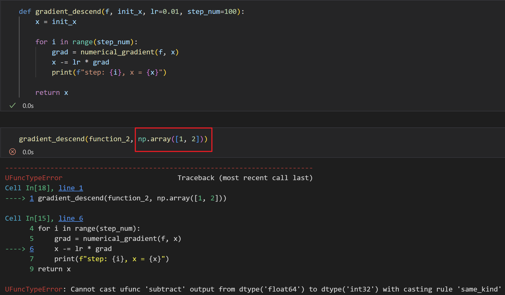

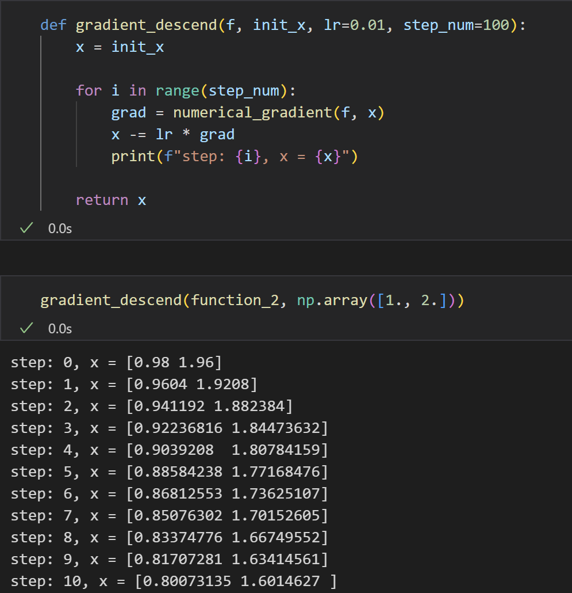


bug：这俩为什么会相同啊？

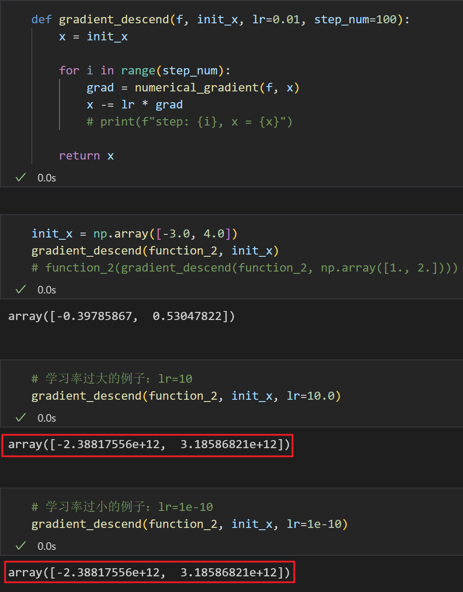

因为梯度下降过程会改变 `init_x` 的值

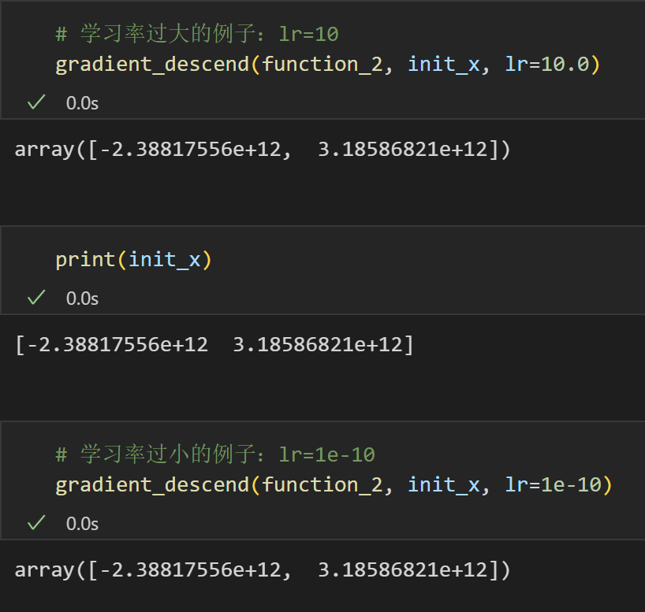


这里梯度不能这么实现，如果x是二维数组会报错

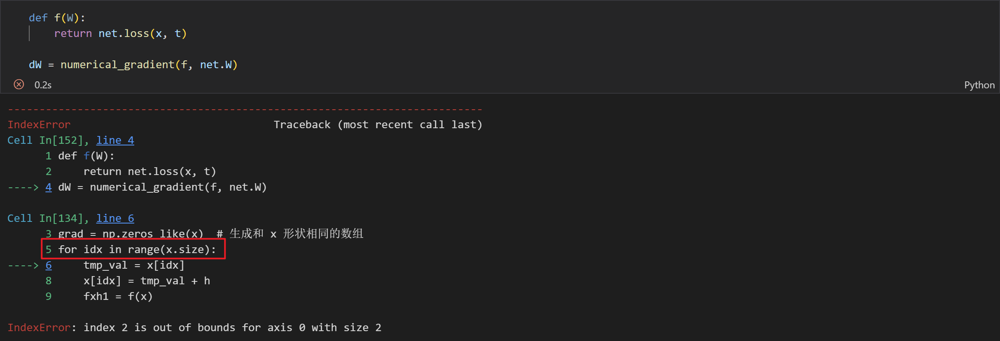

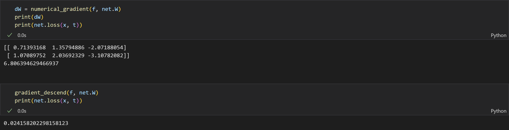

### 4.5 学习算法的实现

这里警告是由于静态检车无法正确识别x_train类型，推荐收集数据时不要用相同变量名，例如 `x_train_list`

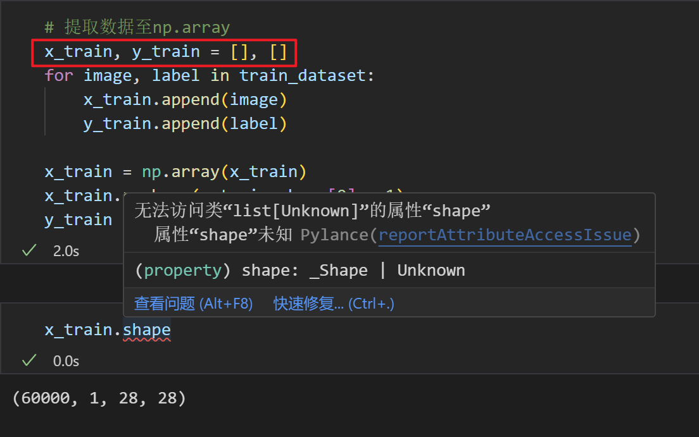

reshape本身不修改形状，需要返回新的元素

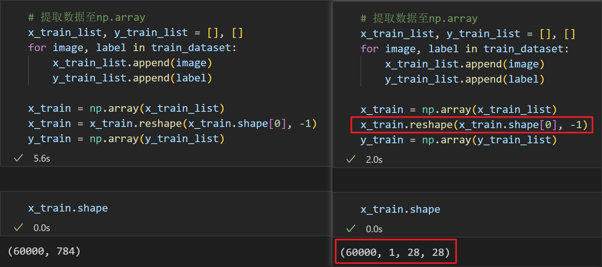

噪声太大没有意义，而且也太慢了

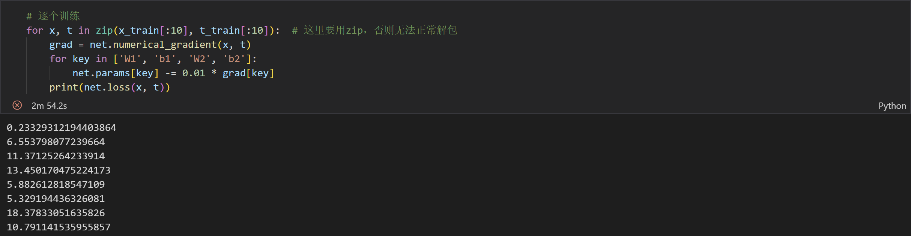

这里取第一个数据进行测试

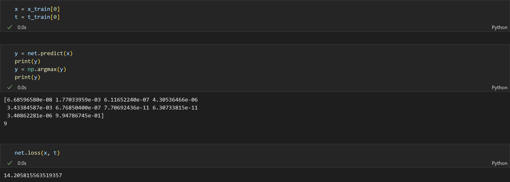

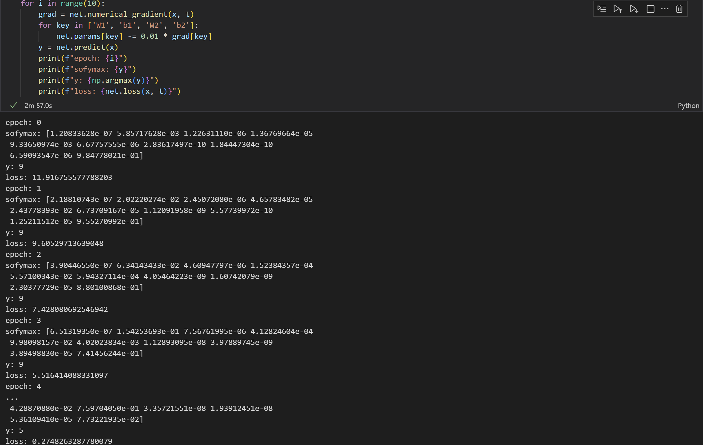

以下是完整的迭代过程，可以看出

```python
epoch: 0
sofymax: [1.20833628e-07 5.85717628e-03 1.22631110e-06 1.36769664e-05
 9.33650974e-03 6.67757555e-06 2.83617497e-10 1.84447304e-10
 6.59093547e-06 9.84778021e-01]
y: 9
loss: 11.916755577788203
epoch: 1
sofymax: [2.18810743e-07 2.02220274e-02 2.45072080e-06 4.65783482e-05
 2.43778393e-02 6.73709167e-05 1.12091958e-09 5.57739972e-10
 1.25211512e-05 9.55270992e-01]
y: 9
loss: 9.60529713639048
epoch: 2
sofymax: [3.90446550e-07 6.34143433e-02 4.60947797e-06 1.52384357e-04
 5.57100343e-02 5.94327114e-04 4.05464223e-09 1.60742079e-09
 2.30377729e-05 8.80100868e-01]
y: 9
loss: 7.428080692546942
epoch: 3
sofymax: [6.51319350e-07 1.54253693e-01 7.56761995e-06 4.12824604e-04
 9.98098157e-02 4.02023834e-03 1.12893095e-08 3.97889745e-09
 3.89498830e-05 7.41456244e-01]
y: 9
loss: 5.516414088331097
epoch: 4
sofymax: [9.94942190e-07 2.70992340e-01 1.06350644e-05 8.79995511e-04
 1.34454113e-01 2.06341951e-02 2.31071596e-08 8.21316357e-09
 5.85884147e-05 5.72969106e-01]
y: 9
loss: 3.8808056223823644
epoch: 5
sofymax: [1.41535367e-06 3.51612682e-01 1.31626709e-05 1.53904306e-03
 1.42734446e-01 8.53167512e-02 3.71381484e-08 1.47025916e-08
 7.90250497e-05 4.18703423e-01]
y: 9
loss: 2.461384464179898
epoch: 6
sofymax: [1.74823042e-06 3.33394459e-01 1.37250255e-05 2.13465365e-03
 1.21247168e-01 2.63223184e-01 4.71306422e-08 2.16509441e-08
 8.98302059e-05 2.79895164e-01]
y: 1
loss: 1.3347529998336007
epoch: 7
sofymax: [1.69345907e-06 2.37674860e-01 1.14629523e-05 2.19052165e-03
 8.44158207e-02 5.06039690e-01 4.56752505e-08 2.36659928e-08
 8.02342003e-05 1.69585647e-01]
y: 5
loss: 0.6811401731690229
epoch: 8
sofymax: [1.44664537e-06 1.61707692e-01 8.90828130e-06 1.92828493e-03
 5.79457183e-02 6.69853046e-01 3.91510905e-08 2.17418484e-08
 6.49781517e-05 1.08489865e-01]
y: 5
loss: 0.40069692533780593
epoch: 9
sofymax: [1.23248520e-06 1.18349537e-01 7.16601312e-06 1.67506827e-03
 4.28870880e-02 7.59704050e-01 3.35721551e-08 1.93912451e-08
 5.36109410e-05 7.73221935e-02]
y: 5
loss: 0.2748263287780079
```

运行时间太久了，尝试模型缩小10倍

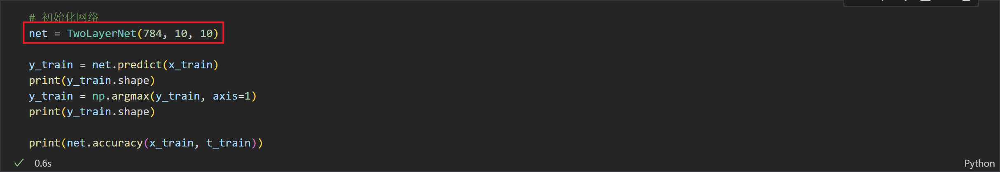

虽然时间快了，但是收敛速度慢了很多，模型学不动了？

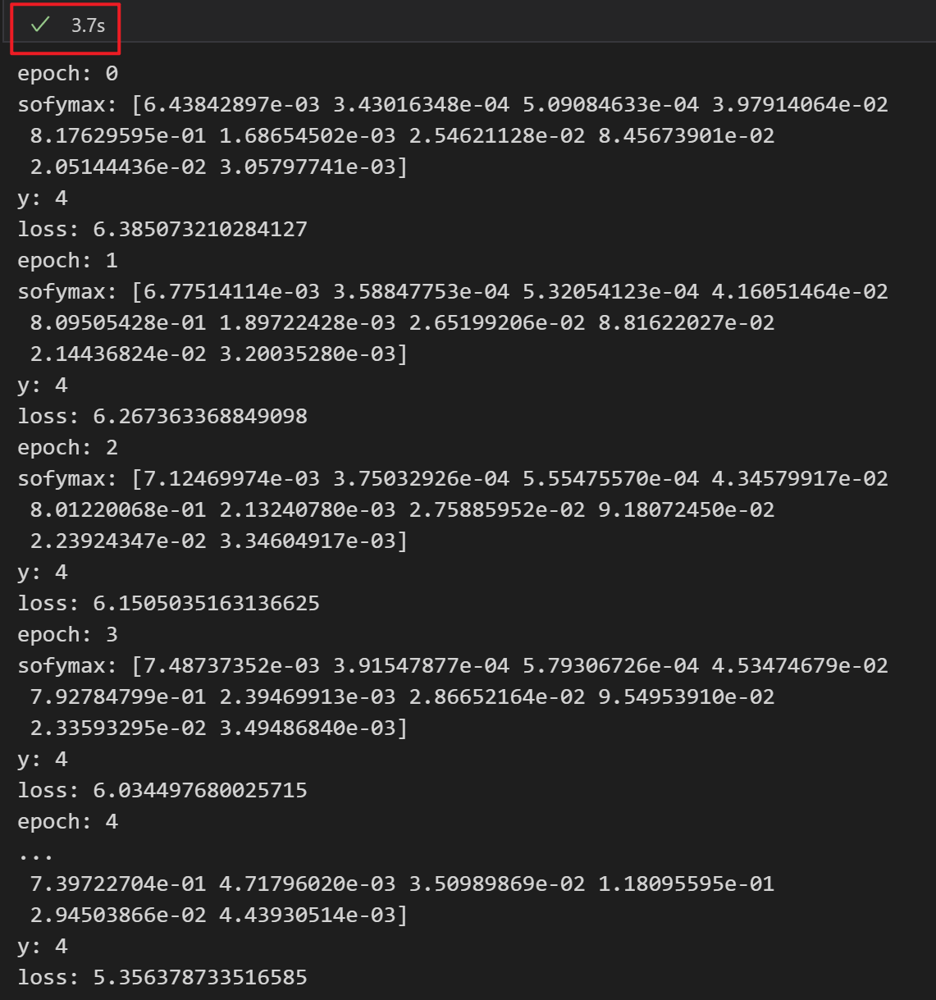

看来还是练的动的，毕竟只有一张图，不存在数据噪声，也就不存在欠拟合

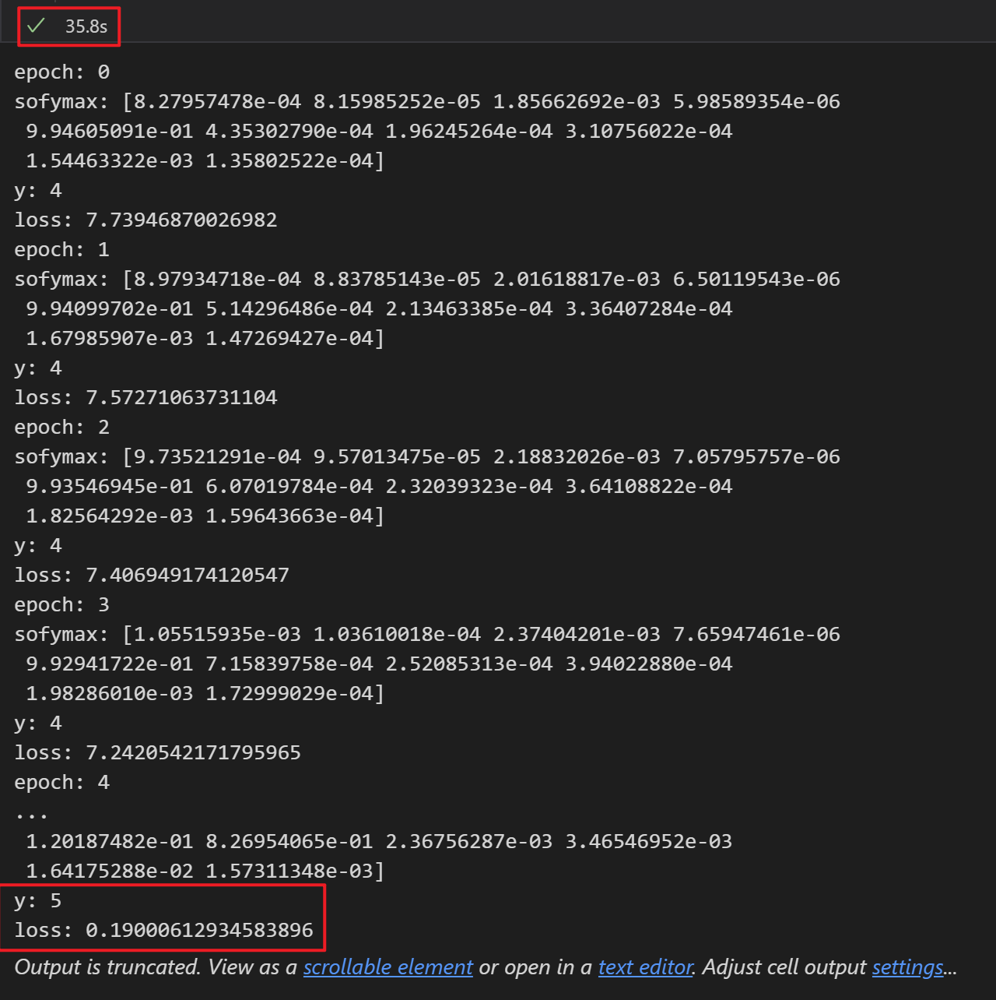

突然想起来还有个relu函数更快

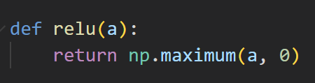

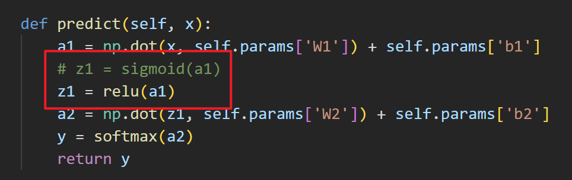

再试一下一开始100层的模型

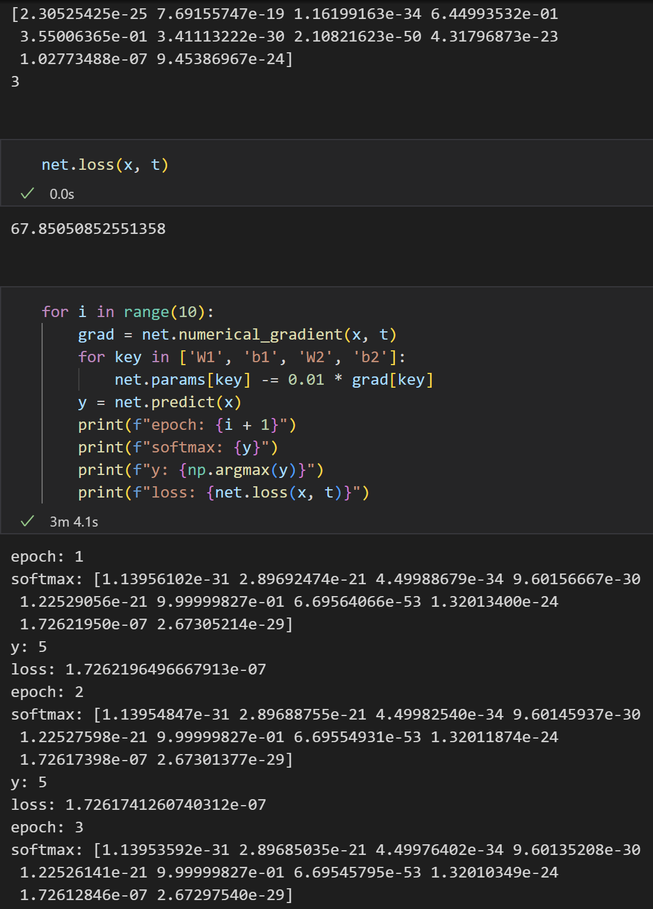

可以看到收敛速度快了不是一点，一个epho就收敛了

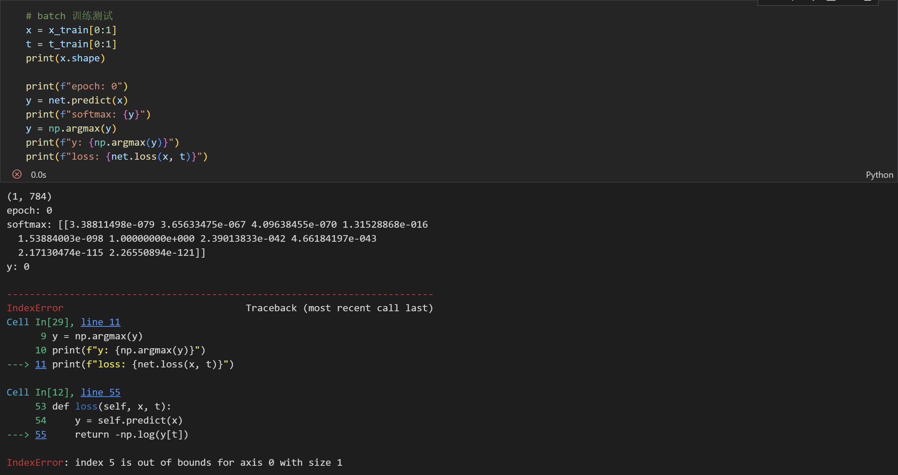

需要兼容多维数组

不过这里 `predict` 竟然不用改？

sigmoid和softmax是否需要修改？

> ### ✅ 1. **Sigmoid：天然支持多维（无需修改）**
>
> - **数学定义**：
>   *σ*(*z*)=1+*e*−*z*1​
>
> - **操作性质**：**逐元素**（element-wise）函数
>
> - **NumPy 行为**：
>   对任意形状的数组（1D、2D、3D...），`np.exp(-a)` 和除法都会自动广播（broadcast），**对每个元素独立计算**。
>
> - **结论**：
>
>   > ✅ 你的原始 `sigmoid` 函数 **无需任何修改**，即可正确处理批量输入（如 `(N, D)`）。 
>
> def sigmoid(a):
>
> ​    return 1 / (1 + np.exp(-a))  # 对 (N, D) 输入，输出 (N, D)，每个元素独立计算
>
> ### ✅ 2. **Softmax：必须显式按“行”归一化（必须修改）**
>
> - **数学定义**（对单个样本）：
>   softmax(*z*)*i*​=∑*j*​*e**z**j*​*e**z**i*​​
> - **关键点**：分母是**同一输入样本所有类别的指数和**（即对“类别维度”归一化）
> - **批量输入时**：
>   - 输入形状：`(N, C)`（N 个样本，C 个类别）
>   - **必须对每一行**（每个样本）：`axis=1`
> - **不修改的后果**：
>   - 若直接用 `np.sum(np.exp(a))`（无 `axis` 参数）：
>     - 分母 = **整个 batch 所有元素的和**
>     - 结果：每个样本的 softmax 被整个 batch 的数据“污染”
>     - **输出不是合法的概率分布**（每行和 ≠ 1）

python广播机制从右向左对齐，直接对axis求和导致第2维消失，则s的axis0维从右向左与a的axis=1对齐，不是softmax希望的结果

使用 `keepdims` 使得axis=1维度不会消失，从而广播机制与压缩前相同

以此类推，使用此参数可以对任意某维度操作，且后续广播时恢复原来的形状

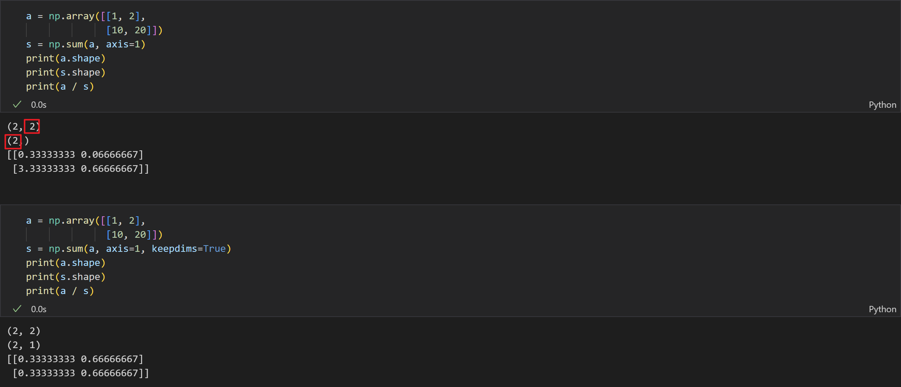

支持batch处理后单样本又训练不了了

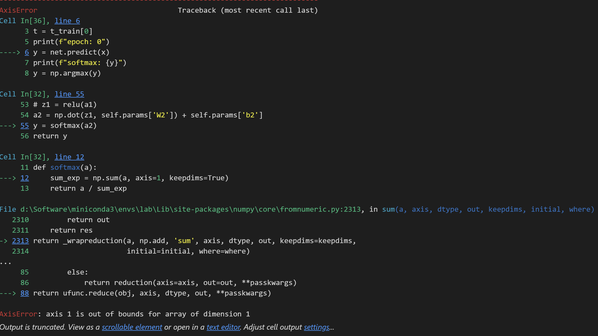

终于单样本和batch都通了

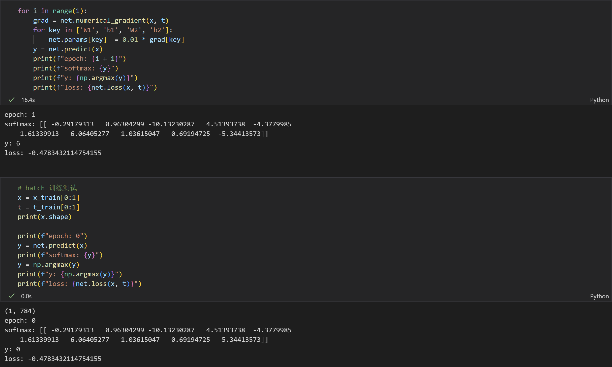

诶，为什么损失是负的？

loss函数没错，那就说明是softmax函数错了

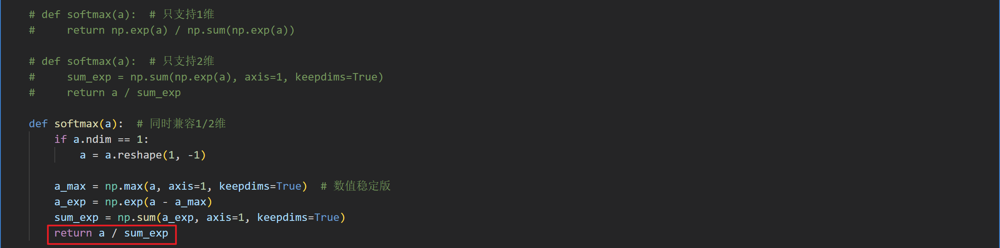

改成数值稳定版后忘了改a...


以batch_size = 10训练，收敛很慢

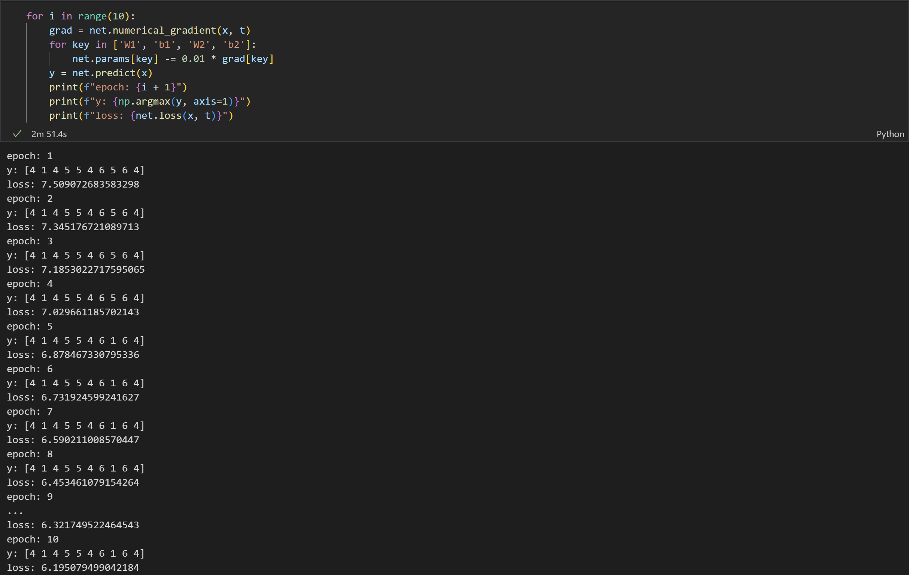


SGD mini-batch实现

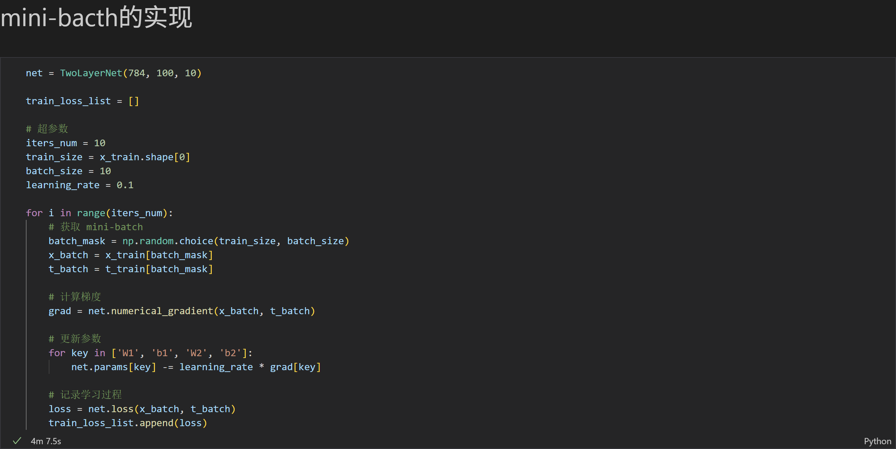

训练太慢了，这里取10次为例

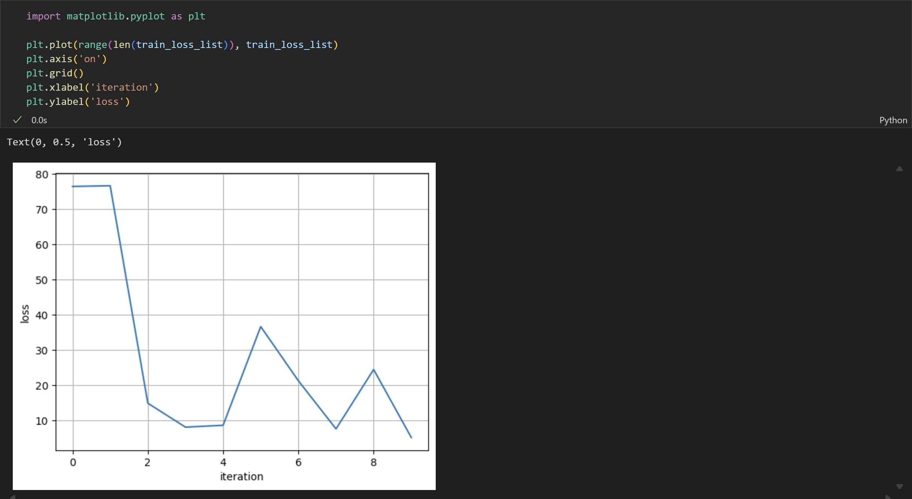

## 第5章 误差反向传播法

### 5.1 计算图

reading...

### 5.2 链式法则

reading...

这里书籍中的问题有点多

作者像是没有学过微积分

已在书籍中修正

### 5.3 反向传播

reading...

### 5.4 简单层的实现

这里有一个问题：全连接层是用乘法层和n个加法层拼起来的吗？

这样好像不太合理

加法层只能有两个输入，而全连接层需要将n（向量长度）个 w @ x 加起来

并不是，用的是专门的Affine

### 5.5 激活函数层的实现

`np.array` `a = b`是引用赋值，不是复制

### 5.6 Affine/Softmax层的实现

#### Affine

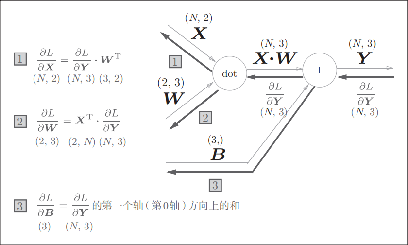

#### Softmax


为什么偏置项反向传播时要求和而不是求均值？

因为损失是累计求和的


反向传播时不仅需要计算dw，也需要计算dx，因为就是靠dx继续向后传播的

dw直接保存在梯度，dx用于return继续传播


计算梯度主要有两种

1. `forward` 的参数 `x` ，用于反向传播，直接 `return` 即可，无需保存
2. `__init__` 的参数 `W` `b`，用于更新参数，因此需要保存


既然训练时和推理时都用不到 `loss`，为什么还要 `return` 呢？

```python
class SoftmaxWithLoss:
 def __init__(self):
 self.loss = None # 损失
 self.y = None # softmax的输出
 self.t = None # 监督数据（one-hot vector）
 def forward(self, x, t):
 self.t = t
 self.y = softmax(x)
 self.loss = cross_entropy_error(self.y, self.t)
 return self.loss
 def backward(self, dout=1):
 batch_size = self.t.shape[0]
 dx = (self.y - self.t) / batch_size
 return dx
```

### 5.7 误差反向传播的实现

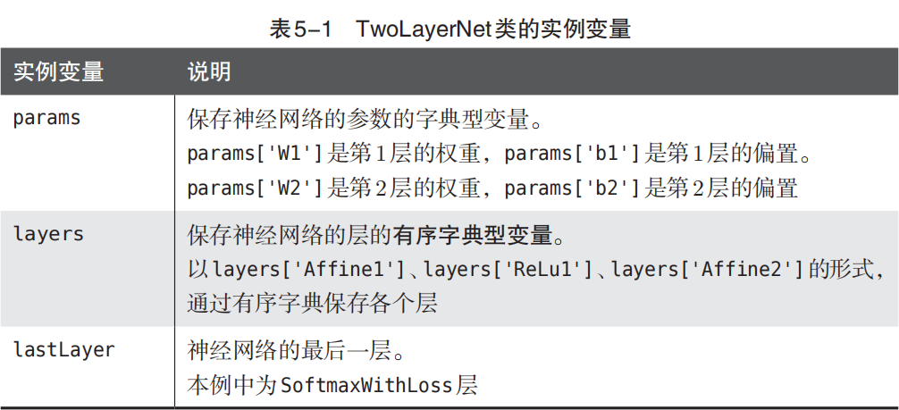

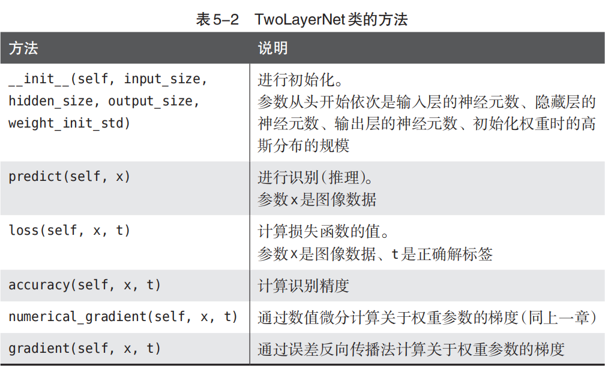


书里错了？
P92

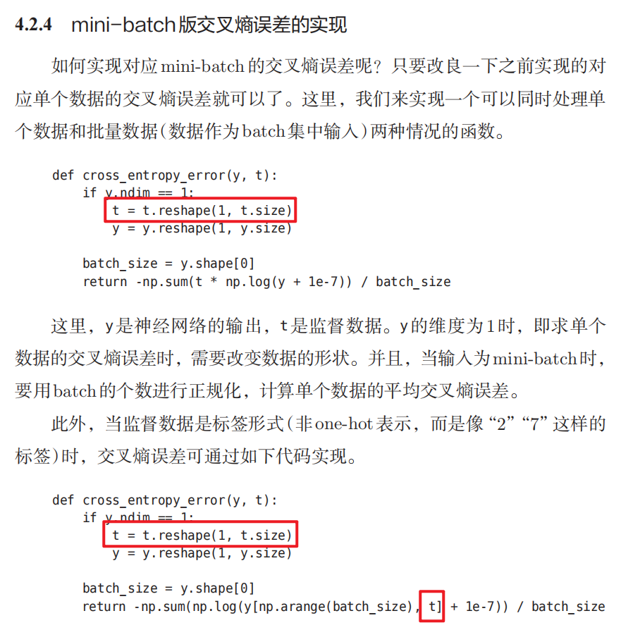

这里 `t` 不能` reshape` 吧？

对于第一种情况：`t` 可以自动广播至于 `y` 一样的形状，是否 `reshpe`均可

对于第二章情况：`reshape` 成2维后 `t` 就不能做索引了啊？

测试结果如下：

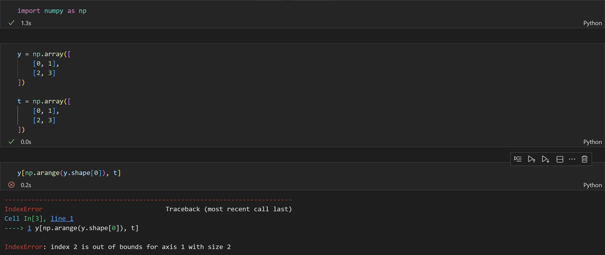

而且直接用 `mean` 即可


这里编译器一直warning好烦啊

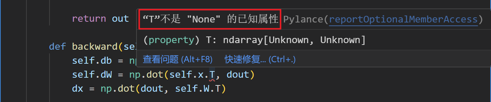

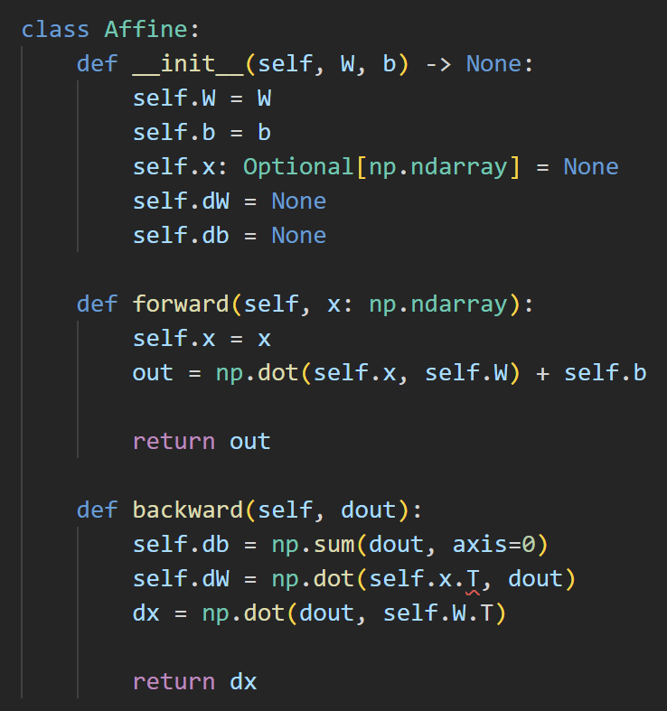

- 为什么 `softmax` `return` `loss` 而不是 `y` ？

> 1. **角色定位：这是一个损失层，不是激活层**
>    - 它位于网络末端，**没有下一层**，职责是计算**标量损失值**（用于优化和监控），而非输出概率。
> 2. **训练流程需求**
>    - 训练时只需 `loss` 值（用于打印、早停等）和中间变量 `y`、`t`（用于反向传播），**无需将 `y` 传出**。
> 3. **设计一致性**
>    - 主流框架（如 PyTorch 的 `CrossEntropyLoss`）均只返回 `loss`，符合标准实践。
> 4. **推理时单独使用 `softmax(x)`**
>    - 若需预测概率（如 `predict`），应**直接调用 `softmax(x)`**，而非通过损失层获取 `y`。

> ✅ **核心理念**：损失层 = 计算 loss + 提供梯度；概率输出 = 推理阶段单独处理。职责分离，接口清晰。 

- 为什么 `predict` `loss` `accuracy` 都是用 `x` 作为参数而不是`y` ？这样不会重复计算吗？

> 1. **接口设计原则**  
>    - 评估函数应只依赖原始输入 `x` 和标签 `t`，不依赖内部状态（如之前计算的 `y`），确保**无状态、可复现、易调用**。
>
> 2. **避免隐式依赖与错误**  
>    - 若依赖 `y`，需确保 `forward()` 已正确执行且 `x` 未变，极易引发**时序 bug**。
>
> 3. **“重算”优于“缓存”**  
>    - 前向传播开销小，重算 `y` 比维护缓存更**简单、安全、通用**。
>    - 深度学习框架普遍采用此策略（如 PyTorch/TensorFlow）。
>
> 4. **支持任意数据评估**  
>    - 可直接对新数据计算 loss/accuracy，无需先调用 `forward()`。
>
> > ✅ **核心理念**：宁可轻微重复计算，也要保证代码清晰、无副作用、易于维护。


真快啊反向传播

能差30000倍是没想到的

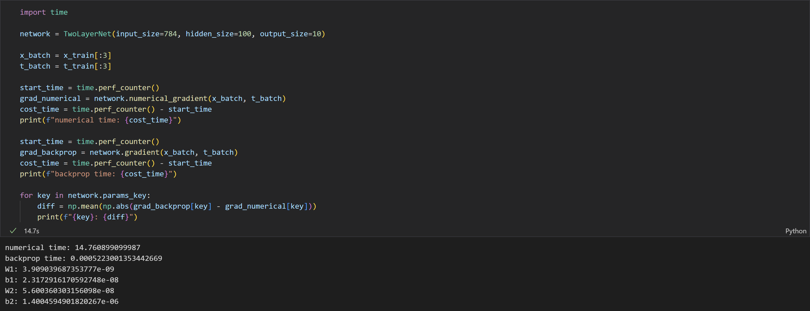

分析：

数值梯度：

总参数量约 784 * 100 = 78400个

每个参数需要计算两次前向传播

共计约15w次

反向传播：

与参数两无关，一共仅需要1次前向传播 + 1次反向传播

说明本例中反向传播的时间约等于前向传播 * 5


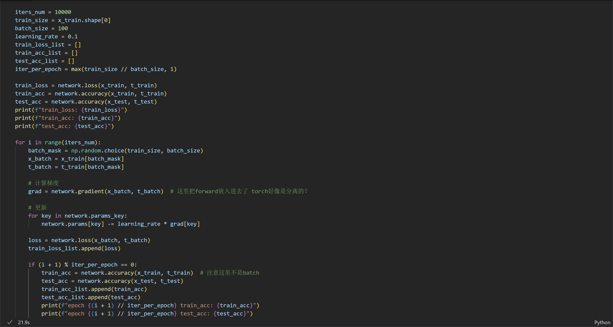

可以看到效果非常好

而且很快 21秒就跑完了10000个iter

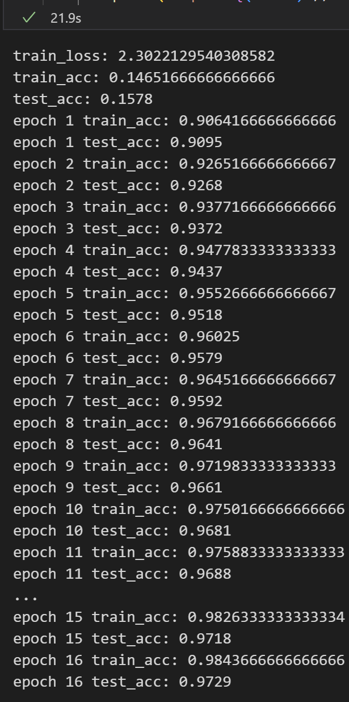

尝试把batch_size改成100→1000，iteration改成10000→1000

可以看到平均每轮epoch的效果下降了

平均每次更新（这里直接对比epoch1和更新后的epoch10）的效果几乎没区别

时间上区别不大 21s→17s，batch=1000并行性稍微好一点点，说明已经达到cpu最大并行效率？如果是GPU呢？

也就是说更大的batch主要优势在于噪声更小

说明对于image数据集，batch=100的噪声已经很小了

突然想到一个概念：**过拟合**

如果batch太小，可以理解为每一次更新梯度都在朝着某个batch的局部最优方向优化，从而导致训练不动了，从训练结果上来看就是每次batch更新的grad反复横跳，或loss反复横跳

这个时候有可能模型还未充分拟合训练集，只是在不停的过拟合某个batch

对于这种情况可以考虑增大batch看看

注意这里的“过拟合”相对的是 某batch 相较于train_dataset，

而通常所说的过拟合是指 train_dataset 相较于全体分布（通常用test_dataset）验证

batch相较于train的关系就是train相较于整体分布的关系（test只是整体分布的一部分样例）

由于该算法使用的是随机batch，从而天然的防止了模型对于x的过拟合（因为拟合到一定程度后就会在不同batch之间摇摆）

这个时候是增大batch让模型更好的拟合train还是停止？

我觉得可以看一下这个时候train和test的关系，test还在上升的话可以说明train还没有过拟合，可以尝试通过增大batch更好的拟合train

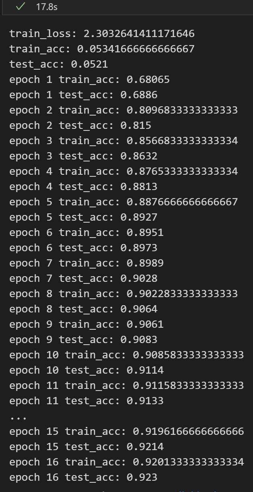

计划：对比torch


bug：准确率始终是一个值

计算梯度的 `dW` 写出 `w` 了

bug：训练特别慢（相较于正常）

`Affine` 忘 + 偏执 `b` 了


这里重新写了一遍，发现训练突然慢了很多


终于发现问题了，区别就在于


为什么初始参数对于收敛速度影响这么大？见6.2

## 第6章 与学习相关的技巧

### 6.1 参数的更新

#### SGD

```python
class SGD:
    def __init__(self, lr=0.01) -> None:
        self.lr = lr

    def update(self, params, grads):
        for key in params.keys():
            params[key] -= self.lr * grads[key]
```

#### Momentum

```python
class Momentum:
    def __init__(self, lr=0.01, momentum=0.9) -> None:
        self.lr = lr
        self.momentum=momentum
        self.v = None

    def update(self, params, grads):
        if self.v == None:
            self.v = {}
            for key, val in params.items():
                self.v =[key] = np.zeros_like(val)
                
        for key in params.key():
            self.v[key] = self.momentum * self.v[key] - self.lr * grads[key]
            params[key] += self.v[key]
```

梯度起到加速度的作用

#### AdaGrad

为什么要累计所有历史梯度的和？这样不是越学越慢吗？

我认为当前的学习率之应该取决于当前（或临近）的信息，而与历史无关。

考虑一种策略：只记录最近几次的梯度情况，梯度越大学习率就越小，或是与Momentum结合，v越大学习率越小。

从这个角度理解的话，可将lr视为时间尺度，即需要重新调整方向的频率。

v负责调整方向，而lr决定每次调整完走多远，或每隔多久重新调整一次。

```python
class AdaGrad:
    def __init__(self, lr=0.01) -> None:
        self.lr = lr
        self.h = None

    def update(self, params, grads):
        if self.h == None:
            self.h = {}
            for key, val in params.item():
                self.h[key] = np.zeros_like(val)

        for key in params.key():
            self.h[key] += np.square(grads[key])
            params[key] -= self.lr * grads[key] / np.sqrt(self.h[key] + 1e-7)
```

为什么要先平方再开方？

平方是为了消除负数

开方是为了防止梯度衰减过快

#### Adam

书中未详解，具体可直接查阅原文。

### 6.2 权重的初始值

coding...

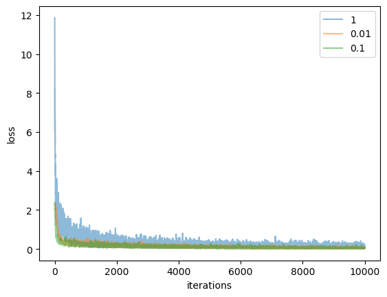

### 6.3 Batch Normalization

为什么batch normal会是有效的？

是否使用了batch normal就没必要初始化权重系数了？

为什么使用了batch normal后反而weight_init_std=1变成效果最好了？（实验结果见code）

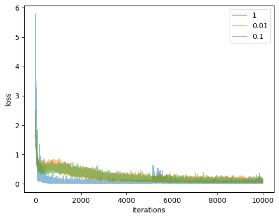

### 6.4 正则化

#### 过拟合

将 `train_size` 从60000减小至600，可见 `train_acc` 很快收敛至100%，而 `test_acc` 最终收敛至80%左右。（实验结果见code）

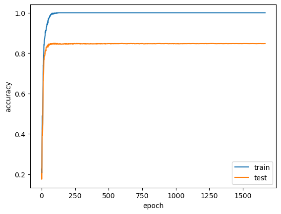

额外发现，将 `train_size` 减小至600后，运行时间从20s增加至2min，经过研究发现，是由于绿色部分占用了大部分时间，将其注释掉后提升至15s。

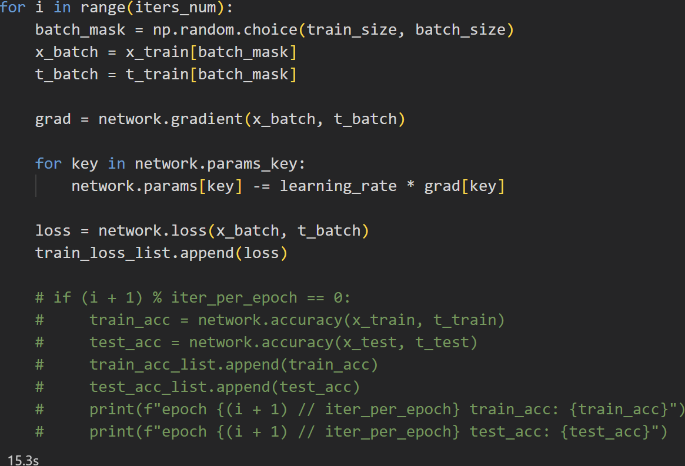

#### L1正则化

```python
class Affine:
    def __init__(self, W, b, weight_decay=0) -> None:  # 增加权值衰减系数
        self.W = W
        self.b = b
        self.weight_decay = weight_decay

        self.x = np.array([])

        self.dW = None
        self.db = None

    def forward(self, x):
        self.x = x

        out = np.dot(x, self.W) + self.b

        return out

    def backward(self, dout):
        self.db = np.sum(dout, axis=0)
        self.dW = np.dot(self.x.T, dout) + self.weight_decay * self.W  # 增加L2loss

        dx = np.dot(dout, self.W.T)

        return dx
```

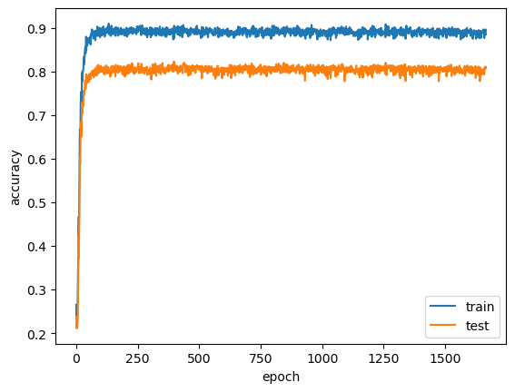

对比过拟合的实验结果发现， `test_acc` 并没有变好，反而 `train_acc` 变差了，这是为什么？

本来以为是 `weight_decay` 的问题，然后做了对照实现

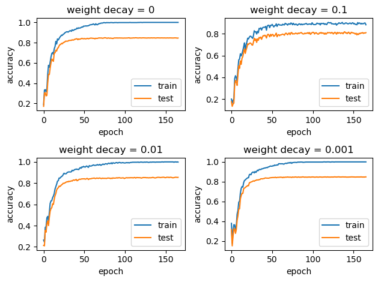

发现训练更平滑了，但是过拟合问题并没有解决。

初步判断是因为 `train_set` 实在是太小了，根本无法学习到 `test_set` 的真实分布，所以是数据分布噪声的问题，不是过拟合的问题。

如果是过拟合的问题，应该会出现 `test_acc` 降低的情况，但是图中 `test_acc` 只是收敛，并没有下降。


形如 `dropdout_ratio` `weight_decay` 这样的参数，应该在 `class Net` 中设置默认参数还是应该在 `class Layer` 中设置默认参数？

#### Dropout

```python
class Dropout:
    def __init__(self, dropout_ratio=0) -> None:
        self.dropout_ratio = dropout_ratio
        self.mask = None  # 这里有点像relu

    def forward(self, x, train_flag):  # 需要区分训练和预测，只有训练时需要dropout  # 需要给所有层都加上
        if train_flag:
            self.mask = np.random.rand(*x.shape) > self.dropout_ratio  # 记得解包s.shape
            out = x * self.mask
        else:
            out = x * (1 - self.dropout_ratio)  # 注意这里不是直接返回x，而是要取平均
        
        return out

    def backward(self, dout):
        dx = dout * self.mask

        return dx
```

看起来结果并不是很好啊， 不过 `train_acc` 和 `test_acc` 确实更接近了（书中结果类似）。

猜测原因与L1正则化相同，因为这个例子根本就无法体现*“过拟合”*。


> 集成学习与 Dropout有密切的关系。这是因为可以将 Dropout理解为，通过在学习过程中随机删除神经元，从而每一次都让不同的模型进行学习。并且，推理时，通过对神经元的输出乘以删除比例（比如，0.5等），可以取得模型的平均值。也就是说，可以理解成。Dropout将集成学习的效果（模拟地）通过一个网络实现了。

### 6.5 超参数的验证

步骤**0**

设定超参数的范围。

步骤**1**

从设定的超参数范围中随机采样。

步骤**2**

使用步骤1中采样到的超参数的值进行学习，通过验证数据评估识别精度（但是要将epoch设置得很小）。

步骤**3**

重复步骤1和步骤2（100次等），根据它们的识别精度的结果，缩小超参数的范围。


随机选择 ＞ 网格搜索

### 6.6 小结

- 参 数 的 更 新 方 法，除 了 SGD 之 外，还 有 Momentum、AdaGrad、Adam等方法。
- 权重初始值的赋值方法对进行正确的学习非常重要。
- 作为权重初始值，Xavier初始值、He初始值等比较有效。
- 通过使用Batch Normalization，可以加速学习，并且对初始值变得健壮。
- 抑制过拟合的正则化技术有权值衰减、Dropout等。
- 逐渐缩小“好值”存在的范围是搜索超参数的一个有效方法。

## 第7章 卷积神经网络

### 7.1 整体结构

卷积层（Convolution层）

池化层（Pooling层）

- [ ] 为什么ReLU在卷积层和池化层中间？

### 7.2 卷积层

- [ ] 为什么偏置是标量？全连接层的偏执不是和输出形状相同吗？

- [ ] 滤波器数量不就等价于全连接层的神经元数量吗？为什么神经元数量是写在最后一维？

### 7.3 池化层

- [ ] 池化层的作用是增强鲁棒性？

### 7.4 卷积层和池化层的实现

`im2col`  “image to collumn”  从图像到矩阵

```python
def im2col (input_data, filter_h, filter_w, stride=1, pad=0):  # 先实现一个不支持stride和pad的版本
    batch_size, channels, height, width = input_data.shape

    out_h = height - filter_h + 1
    out_w = width - filter_w + 1

    col = np.zeros((batch_size, channels, out_h, out_w, filter_h, filter_w))

    for h in range(out_h):
        for w in range(out_w):
            col[:, :, h, w, :, :] = input_data[:, :, h:h + filter_h, w:w + filter_w]
    
    col = col.reshape(batch_size * channels * out_h * out_w, filter_h * filter_w)

    return col
```

- [ ] 自己实现的版本，换一个视角看，好像可以优化成卷积核大小的循环？

- [ ] 输出数据比输入数据多几维就需要基层循环？

- [ ] 每个卷积核大小就代表原图中每个像素需要复制的次数？

- [ ] 所以如果卷积核大小是3 * 3，那只需要 `for i in range(3): for j in range(3)` ？


使用 `im2col` 展开输入数据后，之后就只需将卷积层的滤波器（权重）纵向展开为1列，并计算2个矩阵的乘积即可（如图）。这和全连接层的Affine层进行的处理基本相同。

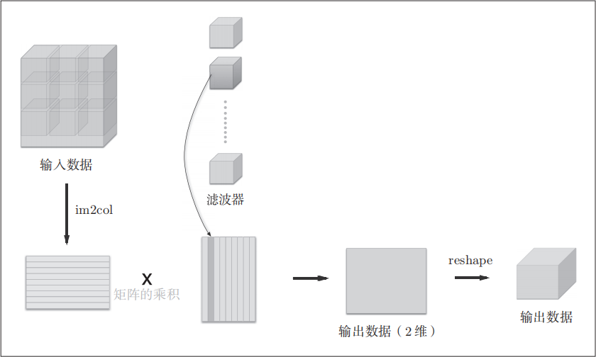

#### 卷积层

```python
class Convolution:  # 目前只支持stride pad采用默认参数
    def __init__(self, W, b, stride=1, pad=0) -> None:
        self.W = W
        self.b = b
        self.stride = stride
        self.pad = pad

    def forward(self, x):
        N, C, H, W = x.shape  # N = batch_size
        FN, C, FH, FW = self.W.shape  # FN是滤波器数量，对应输出的通道数
        # 这两个通道数相同

        col = im2col(x, FH, FW, stride=1, pad=0)
        col_W = self.W.reshape(FN, C * FH * FW).T  # 第0维变成 N * out_h * out_w  # .T和strnapose(1, 0)等价
        out = np.dot(col, col_W) + self.b

        out_h = H - FH + 1  # 只支持stride=1, pad=0
        out_w = W - FW + 1
        out = out.reshape(N, out_h, out_w, FW).transpose(0, 3, 1, 2)  # 通道数可类比为Affine层中的参数维度

        return out
```

#### 池化层

```python
class  Pooling:
    def __init__(self, pool_h, pool_w, stride=1, pad=0) -> None:
        self.pool_h = pool_h  # 卷积层直接传W，而W就包含了FN, C, FH, FW这几个参数，池化层没有参数，只需要传形状h, w
        self.pool_w = pool_w
        self.stride = stride
        self.pad = pad

    def forward(self, x):
        N, C, H, W = x.shape

        col = im2col(x, self.pool_h, self.pool_w, stride=1, pad=0)  # 这里通道数还在1维，需要把通道数放到0维
        col = col.reshape(-1, self.pool_h * self.pool_w)

        out = np.max(col, axis=1)
        
        out_h = H - self.pool_h + 1  # 只支持stride=1, pad=0
        out_w = W - self.pool_w + 1
        out = out.reshape(N, out_h, out_w, C).transpose(0, 3, 1, 2)

        return out
```

池化层和卷积层的区别就在于通道数的处理方式不同。

### 7.5 CNN的实现

- [ ] 为什么是 `Conv` → `ReLU` → `Pooling` 的顺序？
- [ ] 为什么只使用1层卷积层？只提取一次特征？那不是只能提取卷积核大小的特征？那还是只有局部信息呀？

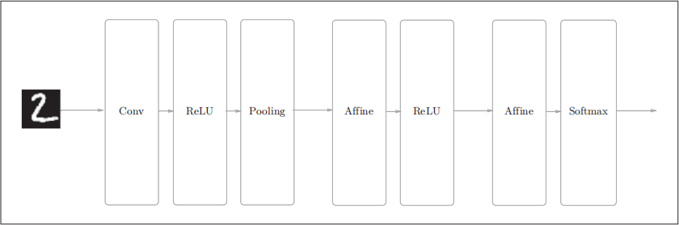

```python
class SimpleConvNet:
    def __init__(self,
                 input_dim=(1, 28, 28),
                 conv_param={'filter_num':30, 'filter_size':5, 'pad':0, 'stride':1},
                 hidden_size=100,
                 output_size=10,
                 weight_init_std=0.01) -> None:
        
        filter_num = conv_param['filter_num']
        filter_size = conv_param['filter_size']
        filter_pad = conv_param['pad']
        filter_stride = conv_param['stride']
        input_size = input_dim[1]
        conv_output_size = input_size - filter_size + 1
        pool_output_size = conv_output_size - 2 + 1 # 默认池化层大小为2 * 2，步长为1

        self.params = {}
        self.params['W1'] = weight_init_std * np.random.randn(filter_num, input_dim[0], filter_size, filter_size)
        self.params['b1'] = np.zeros(filter_num)
        self.params['W2'] = weight_init_std * np.random.randn(filter_num * pool_output_size * pool_output_size, hidden_size)
        self.params['b2'] = np.zeros(hidden_size)
        self.params['W3'] = weight_init_std * np.random.randn(hidden_size, output_size)
        self.params['b3'] = np.zeros(output_size)

        self.layers = OrderedDict()
        self.layers['Conv1'] = Convolution(self.params['W1'], self.params['b1'], self.params['stride'], self.params['pad'])
        self.layers['Relu1'] = Relu()
        self.layers['Pool1'] = Pooling(pool_h=2, pool_w=2)
        self.layers['Affine1'] = Affine(self.params['W2'], self.params['b2'])
        self.layers['Relu2'] = Relu()
        self.layers['Affine2'] = Affine(self.params['W3'], self.params['b3'])
        
        self.last_layer = SoftmaxWithLoss()
    
    def predict(self, x):
        for layer in self.layers.values():
            x = layer.forward(x)
            return x
        
    def loss(self, x, t):
            y = self.predict(x)
            return self.last_layer.forward(y, t)
        
    def gradient(self, x, t):
        self.loss(x, t)

        dout = 1
        dout = self.last_layer.backward(dout)

        layers = list(self.layers.values())
        layers.reverse()

        for layer in layers:
             dout = layer.backward(dout)
        
        grads = {}
        grads['W1'] = self.layers['Conv1'].dW
        grads['b1'] = self.layers['Conv1'].db
        grads['W2'] = self.layers['Affine1'].dW
        grads['b2'] = self.layers['Affine1'].db
        grads['W3'] = self.layers['Affine2'].dW
        grads['b3'] = self.layers['Affine2'].db

        return grads
```

### 7.6 CNN的可视化


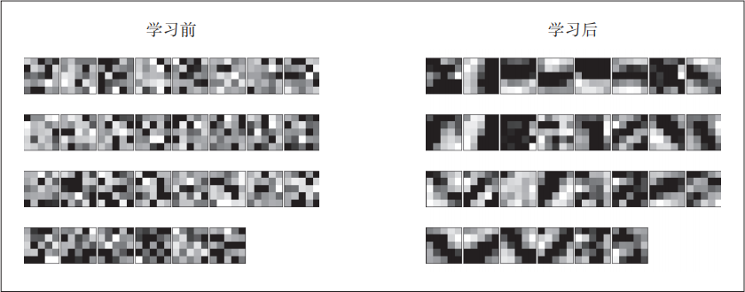

左半部分为白色、右半部分为黑色的滤波器的情况下，会对垂直方向上的边缘有响应。

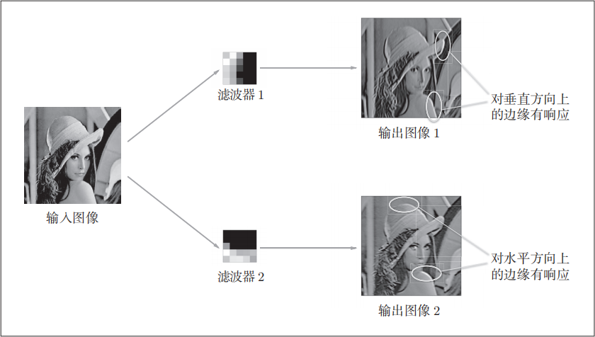

CNN的卷积层中提取的信息。第1层的神经元对边缘或斑块有响应，第3层对纹理有响应，第5层对物体部件有响应，最后的全连接层对物体的类别（狗或车）有响应。

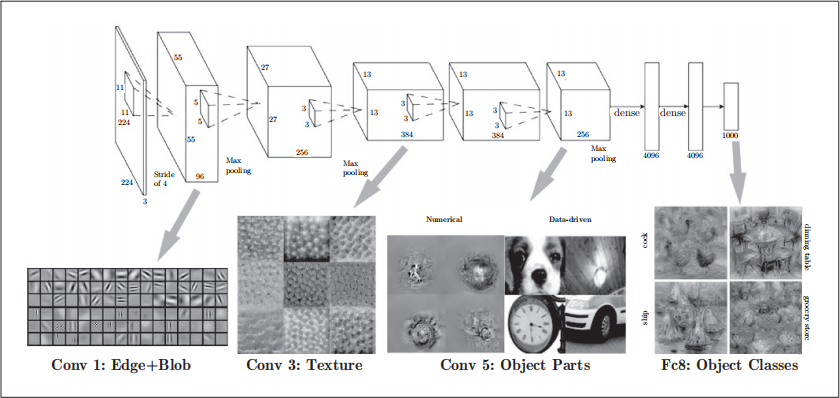

### 7.7 具有代表性的CNN

#### LeNet

#### AlexNet

### 7.8 小结

- CNN在此前的全连接层的网络中新增了卷积层和池化层。
- 使用im2col函数可以简单、高效地实现卷积层和池化层。
- 通过CNN的可视化，可知随着层次变深，提取的信息愈加高级。
- LeNet和AlexNet是CNN的代表性网络。
- 在深度学习的发展中，大数据和GPU做出了很大的贡献。

## 第8章 深度学习

### 8.1 加深网络

对于这种情况，并不是模型的学习能力不足或是模型无法拟合分布。而是数据集本身存在缺陷/噪声/随机性。

想到一个例子，用神经网络预测抛硬币的数据集，正确率最高也只有50%。这不是神经网络的极限，而是数据集的极限。


#### 加深层的好处

- 与没有加深层的网络相比，加深了层的网络可以用更少的参数达到同等水平（或者更强）的表现力。
- 与没有加深层的网络相比，通过加深层，可以减少学习数据，从而高效地进行学习。

### 8.2 深度学习的小历史

- [x] 为什么ResNet效果会这么好？本质上不就是x跨了一层吗？那效果再好也只不过是相当于层数减半的效果罢了？

  ResNet并非单层跳跃，而是多个残差块穿梁，形成从输入到输出的端到端直通路径！衰减直接从指数级变成常数级 \[O(1)\] ，并非只是次数减半。

### 8.3 深度学习的高速化

- [ ] 分布式学习？联邦学习？

### 8.4 深度学习的应用案例

#### 物体检测

- [ ] 可以端到端吗？既输入是图像，输出是两个坐标？或输出是中心+长宽？

#### 图像分割

全连接层和卷积层可以相互替换实现相同的处理。（卷积核和图像一样大）

- [ ] 这么说卷积核的全连接层的本质区别在于将1维变成了2维？

#### 图像标题的生成

### 8.5 深度学习的未来

#### 图像风格变换

#### 图像的生成

- [ ] GAN的思想是否适用于其他场景？

#### 自动驾驶

#### Deep Q-Network（强化学习）

### 8.6 小结

- 对于大多数的问题，都可以期待通过加深网络来提高性能。

- 在最近的图像识别大赛ILSVRC中，基于深度学习的方法独占鳌头，使用的网络也在深化。

- VGG、GoogLeNet、ResNet等是几个著名的网络。

- 基于GPU、分布式学习、位数精度的缩减，可以实现深度学习的高速化。

- 深度学习（神经网络）不仅可以用于物体识别，还可以用于物体检测、图像分割。

- 深度学习的应用包括图像标题的生成、图像的生成、强化学习等。最近，深度学习在自动驾驶上的应用也备受期待。
